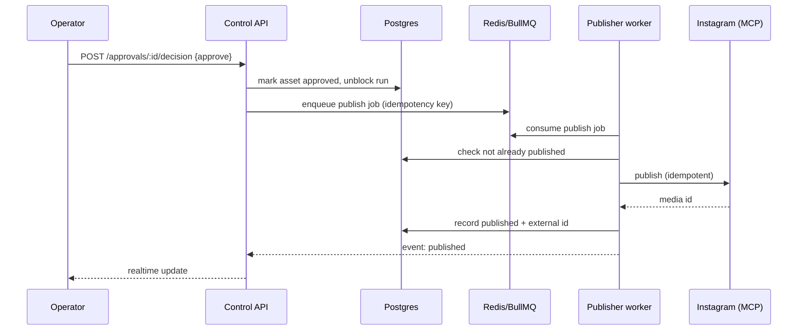
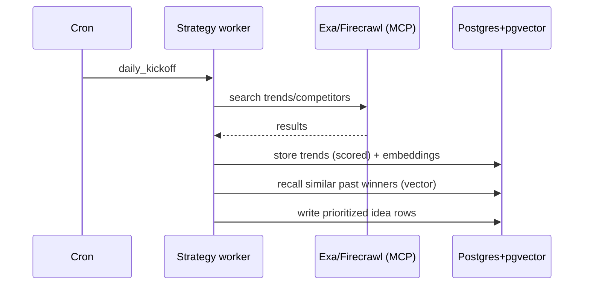

# 02 — System Architecture Specification

**Document:** 02 of 16 · **Status:** Baseline · **Owner:** Platform Engineering

---

## 1. Purpose & scope

This document defines the technical architecture of COS: the services and their
boundaries, how data and control flow between them, the runtime topology, the technology
choices and why, and the cross-cutting concerns (security, observability, cost, scaling).
It is the contract that docs 04–08, 10, and 14–15 build upon.

## 2. Architectural style

COS is a **modular monolith on the control plane** (a single Next.js application) fronting
an **asynchronous, queue-driven agent runtime** (workers executing LangGraph workflows).
This split is deliberate:

- The **control plane** (dashboard, APIs, auth, approvals) benefits from a single
  deployable, typed end-to-end, fast to iterate — a modular monolith.
- The **agent runtime** is long-running, bursty, and failure-prone — it belongs in
  background workers driven by durable queues, isolated from request/response latency.

```
        ┌──────────────────────────── Users (browser) ────────────────────────────┐
        │                        Mission Control (Next.js/React)                    │
        └───────────────▲───────────────────────────────────────────▲──────────────┘
                        │ HTTPS (RSC + API routes + WebSocket/SSE)    │
        ┌───────────────┴───────────────────────────────────────────┴──────────────┐
        │                         CONTROL PLANE  (Next.js app)                       │
        │  ┌────────────┐  ┌──────────────┐  ┌───────────────┐  ┌────────────────┐  │
        │  │ Auth (Supa)│  │ REST/RPC API │  │ Realtime hub  │  │ Approval svc   │  │
        │  └────────────┘  └──────────────┘  └───────────────┘  └────────────────┘  │
        └───────┬─────────────────┬───────────────────┬───────────────────┬─────────┘
                │ SQL             │ enqueue           │ pub/sub            │ SQL
        ┌───────▼───────┐  ┌──────▼───────┐   ┌───────▼───────┐   ┌────────▼────────┐
        │ PostgreSQL    │  │ Redis        │   │ Redis pub/sub │   │ PostgreSQL      │
        │ + pgvector    │  │ (BullMQ)     │   │ (events)      │   │ (audit/logs)    │
        └───────▲───────┘  └──────┬───────┘   └───────────────┘   └─────────────────┘
                │ SQL             │ dequeue
        ┌───────┴─────────────────▼──────────────────────────────────────────────────┐
        │                      AGENT RUNTIME  (worker processes)                       │
        │   LangGraph orchestrator  ·  Agent executors  ·  MCP tool clients            │
        │   ┌──────────┐ ┌───────────┐ ┌──────────┐ ┌──────────┐ ┌─────────────────┐  │
        │   │ CEO graph│ │ Dept graphs│ │ Pipeline │ │ Memory   │ │ Analytics jobs  │  │
        │   └──────────┘ └───────────┘ └──────────┘ └──────────┘ └─────────────────┘  │
        └───────┬──────────────────────────────────────────────────────────┬──────────┘
                │ MCP (stdio/http)                                          │ SQL/vector
        ┌───────▼───────────────────────────────────────────────┐  ┌───────▼─────────┐
        │   EXTERNAL TOOLS via MCP servers                        │  │ Vector store    │
        │   Instagram · Canva · Firecrawl · Exa · Reddit · YT ·   │  │ (pgvector)      │
        │   Notion · Slack · Discord · Resend · PostHog · Drive   │  └─────────────────┘
        └─────────────────────────────────────────────────────────┘
```

## 3. Logical components

### 3.1 Control plane (Next.js application)

| Component | Responsibility |
|-----------|----------------|
| **Web UI (RSC + client components)** | Mission Control and department workspaces (doc 07). |
| **API layer (route handlers / server actions)** | Typed endpoints for reads, mutations, approvals, enqueue. |
| **Auth** | Supabase Auth (email + OAuth); session + RLS-backed data access. |
| **Realtime hub** | Server-Sent Events / WebSocket bridge over Redis pub/sub for live status. |
| **Approval service** | HITL gates: list, approve, reject, request-changes; unblocks paused runs. |
| **Scheduler API** | Create/update schedules; talks to the automation subsystem (doc 14). |
| **Admin/health** | Tool status, secrets status (not values), run traces, cost dashboard. |

### 3.2 Agent runtime (workers)

| Component | Responsibility |
|-----------|----------------|
| **Orchestrator** | Loads and runs LangGraph graphs for CEO, departments, and the pipeline. |
| **Agent executor** | Runs a single agent's contract: recall → prompt → tool-calls → output → memory write. |
| **MCP tool clients** | Typed clients to MCP servers; enforce per-agent permissions and rate limits. |
| **Memory service** | Reads/writes episodic/semantic/vector memory (doc 05). |
| **Analytics workers** | Metric collection, clustering, recommendation generation (doc 13). |
| **Publisher workers** | Idempotent publishing to platform adapters (doc 08). |
| **Notifier** | Sends notifications via Slack/Discord/Resend and writes in-app notifications. |

### 3.3 Data stores

| Store | Use |
|-------|-----|
| **PostgreSQL** | System of record: agents, tasks, assets, runs, schedules, analytics, memory metadata. |
| **pgvector** | Embeddings for memory recall and knowledge-base RAG. |
| **Redis** | BullMQ queues, rate-limit counters, ephemeral caches, pub/sub for realtime. |
| **Object storage (Supabase Storage / Drive)** | Rendered assets, exports, large artifacts. |

## 4. Technology choices & rationale

| Layer | Choice | Why |
|-------|--------|-----|
| App framework | **Next.js (App Router) + React + TypeScript** | One deployable for UI + API; RSC for fast dashboards; end-to-end types. |
| Styling/UI | **Tailwind CSS + shadcn/ui** | Fast, consistent, accessible primitives; matches doc 07 design system. |
| DB | **PostgreSQL + pgvector** | Relational integrity + native vector search in one store; no separate vector DB to operate. |
| Auth/storage | **Supabase** | Managed Postgres, Auth, Storage, RLS; reduces ops burden. |
| Orchestration | **LangGraph** | Explicit, resumable state machines with HITL and durable checkpoints — matches doc 06. |
| Tooling | **Model Context Protocol (MCP)** | Uniform, typed tool interface; swap providers without touching agent logic. |
| Model access | **OpenRouter (+ Claude/OpenAI direct)** | Multi-model routing; cost/latency/quality tradeoffs per stage. |
| Queues/jobs | **Redis + BullMQ** | Durable background jobs, retries, rate limiting, scheduling. |
| Analytics (product) | **PostHog** | Event analytics + funnels for the dashboard itself and content events. |
| Research | **Firecrawl + Exa** | Web crawl + neural search for trend/competitor research. |
| Deploy | **Vercel (control plane) + worker host** | Vercel for the app; a persistent host/container for long-running workers. |

> **Design note — workers off Vercel.** Vercel serverless functions are unsuitable for
> long-running agent graphs. Workers run on a persistent container platform (e.g., a
> Railway/Fly/Render/Container service). The control plane on Vercel enqueues; workers
> consume. See doc 15 for topology.

## 5. Runtime topology

```
Vercel (control plane)          Worker host (agent runtime)        Managed services
──────────────────────          ───────────────────────────       ─────────────────
Next.js app (edge+node)   ⇄     worker pool (N replicas)     ⇄     Supabase Postgres+pgvector
  - RSC pages                     - orchestrator                    Upstash/Redis
  - API routes/actions            - agent executors                 Object storage
  - realtime bridge               - MCP clients                     PostHog
                                   - BullMQ consumers                Model providers (OpenRouter…)
                                   - cron/scheduler                  External tool APIs (via MCP)
```

- **Enqueue path:** UI/API → BullMQ (Redis) → worker consumes → runs graph.
- **Realtime path:** worker emits events → Redis pub/sub → control-plane realtime hub →
  SSE/WebSocket → browser.
- **Data path:** both planes read/write Postgres; workers additionally do vector ops.

## 6. Key data & control flows

### 6.1 Daily automation loop (control flow)

```
cron (06:00) ─► enqueue "daily_kickoff"
   worker: CEO graph starts
     ├─ Strategy dept: trends + competitors + audience  ─► writes research rows
     ├─ Creative: ideas ─► prioritise ─► drafts (pipeline runs per asset)
     ├─ Design: specs/designs for eligible assets
     ├─ Approval gate: assets needing HITL pause ─► notify operator
     ├─ Publishing: schedule approved assets to optimal slots
     └─ (later) Analytics: collect metrics for recently published ─► learn ─► memory
```

Full detail in doc 14; per-asset detail in doc 12.

### 6.2 Single asset through the pipeline (control flow)

```
idea ─► hook ─► outline ─► draft ─► brand review ─► grammar ─► SEO ─►
IG optimise ─► design ─► thumbnail ─► approval(HITL) ─► schedule ─► publish ─►
analytics ─► learning ─► memory update
```

Each arrow is a LangGraph node; the graph checkpoints after every node so a crash resumes
mid-pipeline (doc 06).

### 6.3 Tool call (control flow with guards)

```
agent executor ─► permission check (can this agent use this tool?)
              ─► rate-limit check (Redis token bucket)
              ─► budget check (per-run/day $ cap)
              ─► MCP client call ──(success)──► record result + cost ─► continue
                                └─(failure)──► retry policy (doc 06) ─► fallback/escalate
```

## 7. API surface (overview)

The full endpoint catalogue lives with the data model (doc 04 §API) and UI (doc 07). At
the architecture level, the control plane exposes these groups:

| Group | Examples | Auth |
|-------|----------|------|
| **Dashboard reads** | `GET /api/overview`, `GET /api/agents/status`, `GET /api/queue` | session |
| **Assets** | `GET/POST /api/assets`, `GET /api/assets/:id`, `PATCH /api/assets/:id` | session + RLS |
| **Approvals** | `GET /api/approvals`, `POST /api/approvals/:id/decision` | session (approver role) |
| **Runs** | `GET /api/runs`, `GET /api/runs/:id/trace`, `POST /api/runs/:id/retry` | session |
| **Schedules** | `GET/POST/PATCH /api/schedules` | session |
| **Analytics** | `GET /api/analytics/*`, `GET /api/reports/weekly/:id` | session |
| **Admin** | `GET /api/health`, `GET /api/tools/status`, `GET /api/costs` | admin |
| **Realtime** | `GET /api/stream` (SSE) / `wss://…/realtime` | session |
| **Internal (worker↔control)** | signed RPC for run updates, notifications | service token |

Conventions: JSON; cursor pagination; `problem+json` errors; optimistic concurrency via
`updated_at`/`version`; all mutations idempotent via `Idempotency-Key` where outward-facing.

## 8. Cross-cutting concerns

### 8.1 Security

- **AuthN:** Supabase Auth; short-lived JWT; refresh rotation.
- **AuthZ:** Role-based (owner/admin/editor/viewer) at the API; **RLS** at the DB;
  **per-agent tool permissions** in the runtime (doc 03/08).
- **Secrets:** stored in the deploy platform's secret manager / Supabase Vault; never in
  DB rows or logs; workers receive them via env at runtime.
- **Least privilege:** each MCP tool client is scoped to the minimum permission set.
- **Audit:** all outward/destructive actions logged to an append-only audit table (doc 04).

### 8.2 Observability

- **Logs:** structured JSON, correlation-id per run and per job.
- **Traces:** every run has a persisted trace (nodes, tool calls, tokens, cost, timing) —
  surfaced in the UI (doc 07 Run Inspector).
- **Metrics:** per-agent success rate, latency, retries; queue depth; tool error rates.
- **Product analytics:** PostHog events for both content performance and app usage.
- **Alerting:** thresholds on queue depth, run failure rate, tool outages, budget burn.

### 8.3 Cost governance

- Per-stage model selection (cheap models for cheap stages) — doc 09.
- Per-run and per-day token/$ budgets enforced in the executor; hard stop + alert on cap.
- Caching of embeddings and idempotent tool results to avoid rework.
- Cost recorded per run/agent/tool for the cost dashboard.

### 8.4 Reliability & idempotency

- **Durable checkpoints** (LangGraph) → resumable runs.
- **Idempotency keys** on publish/send/delete → no duplicates on retry.
- **Exactly-once publish** enforced by a unique `(asset_id, platform, target)` constraint
  plus a pre-publish check against platform state where available.
- **Circuit breakers** on flaky tools; **dead-letter queue** for poison jobs.

### 8.5 Scalability

- Stateless workers scale horizontally on queue depth.
- Queue concurrency tuned per tool's rate limits.
- Postgres read replicas for analytics-heavy reads if needed.
- Embeddings batched; vector indexes (HNSW/IVFFlat) tuned in doc 04.

## 9. Environments

| Env | Purpose | Data | Model spend |
|-----|---------|------|-------------|
| **local** | Dev on a laptop | seeded/synthetic | mock or low-cost models |
| **staging** | Pre-prod, real tools in sandbox mode | test accounts | capped budgets |
| **production** | Live Zentrix operation | real | budgeted |

Promotion is via CI/CD (doc 15). Migrations are forward-only and versioned (doc 04).

## 10. Failure domains & degradation

| Failure | Behaviour |
|---------|-----------|
| A tool/API down | Circuit-break; retry with backoff; degrade the dependent stage to manual-assist; notify. |
| Model provider down | Route to fallback provider via OpenRouter; if all down, pause affected runs, notify. |
| Redis down | Control plane serves reads; enqueues buffer/fail-fast with retry; workers idle-safe. |
| Postgres down | System read-degraded; writes fail safe; runs pause on checkpoints. |
| Worker crash | Job re-queued; run resumes from last checkpoint; no double side-effects (idempotency). |

## 11. Directory / module layout (target)

```
apps/
  web/                     # Next.js control plane (UI + API)
    app/                   # routes (RSC + client)
    server/                # API handlers, services (auth, approvals, scheduler)
    ui/                    # shadcn components, design system
  worker/                  # agent runtime
    orchestrator/          # LangGraph graphs (ceo, departments, pipeline)
    agents/                # per-agent executors + contracts
    tools/                 # MCP clients + permission/rate-limit guards
    memory/                # memory service (doc 05)
    analytics/             # collectors, clustering, recommendations (doc 13)
    publishing/            # platform adapters (doc 08)
    scheduler/             # cron + BullMQ producers (doc 14)
packages/
  db/                      # schema, migrations, typed queries (doc 04)
  shared/                  # shared types, message envelope (doc 10), zod schemas
  prompts/                 # prompt library (doc 09)
  knowledge/               # KB loaders, chunkers, embedders (doc 11)
infra/                     # IaC, deploy config (doc 15)
```

## 12. Sequence diagrams (Mermaid)

### 12.1 Approve → publish



### 12.2 Trend → idea



## 13. Compliance with product principles (traceability)

- *Memory before generation* → executor always recalls before prompting (§6.3, doc 05).
- *Tools over hallucination* → agents cannot fabricate metrics; analytics read from DB
  populated by tool collectors (doc 13).
- *Human-by-exception* → HITL is a first-class node type with a dedicated service (§3.1).
- *Idempotent & resumable* → checkpoints + idempotency keys (§8.4).

## 14. Open questions

- OQ-01 Worker host of record (Railway vs Fly vs Render vs self-managed container)?
- OQ-02 SSE vs WebSocket for realtime at target scale — start with SSE, revisit.
- OQ-03 Single Postgres vs separate analytics warehouse if volume grows (defer).

*End of document 02.*
